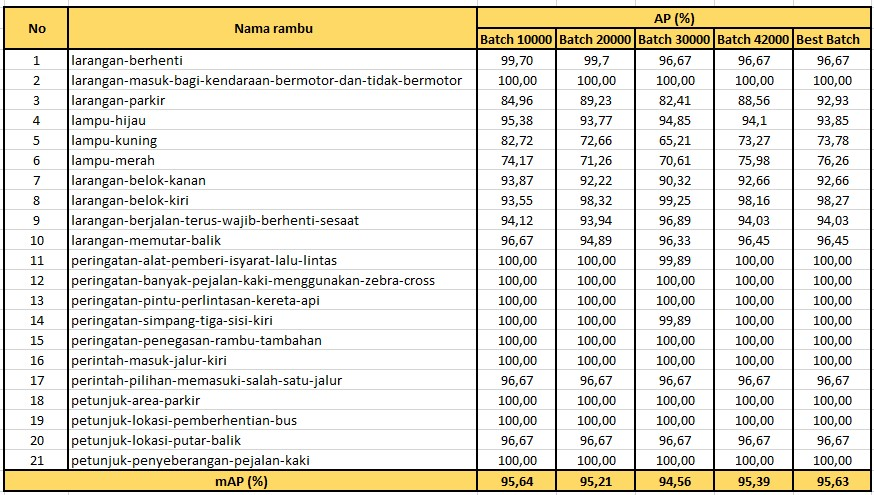
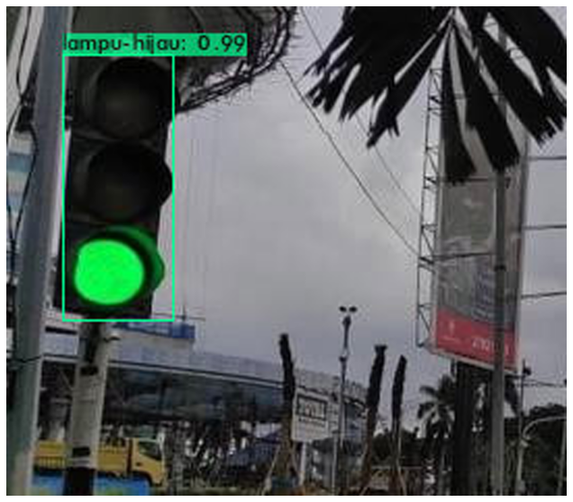
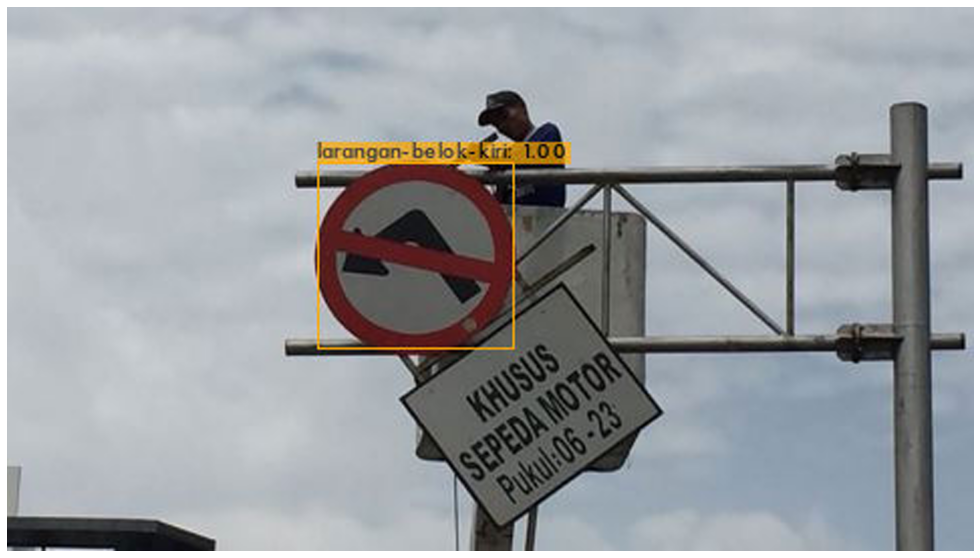

# Pendeteksian Objek Dataset Rambu Lalu Lintas Indonesia menggunakan Algoritma Deep Learning YOLO (You Only Look Once)

- [Paper](paper_id.pdf)
- [Demo Implementasi](https://youtu.be/ZndeLSH5VeA)

# Daftar Isi
- [Tujuan](#tujuan)
- [Abstrak](#abstrak)
- [Rambu Lalu Lintas](#rambu-lalu-lintas)
  - [Bentuk Dataset](#bentuk-dataset)
  - [Jumlah Rambu](#jumlah-rambu)
- [Jumlah Total Dataset](#jumlah-total-dataset)
- [Pembagian Dataset](#pembagian-dataset)
- [Tools](#tools)
- [Terminologi](#terminologi)
  - [Object Detection](#object-detection)
  - [Deep Learning](#deep-learning)
  - [Convolutional Neural Network](#convolutional-neural-network)
  - [You Only look Once](#you-only-look-once)
- [Hasil Penelitian](#hasil-pelatihan)
- [Pengujian Hasil Training](#pengujian-hasil-training)
  - [Dengan Gambar](#dengan-gambar)
  - [Dengan Video](#dengan-video)
- [Lainnya](#lainnya)
- [Credits](#credits)

## TUJUAN
Untuk mewujudkan implementasi Computer Vision di Indonesia khususnya dalam penelitian Autonomous Vehicle dibutuhkan kontribusi dalam berbagai aspek. Salah satu kontribusi yang dilakukan pada penelitian ini adalah pengumpulan dataset rambu lalu lintas di Indonesia yang dapat dimanfaatkan untuk pendeteksian rambu lalu lintas di Indonesia. Dari pengumpulan dataset tersebut akan dibuatkan model Deep Learning-nya lalu diimplementasikan menggunakan salah satu algoritma Deep Learning YOLOv4 (You Only Look Once versi 4) untuk pendeteksian objek rambu lalu lintas yang ada di Indonesia.

## ABSTRAK
Autonomous Vehicle adalah kendaraan yang dapat berfungsi sebagaimana kendaraan pada umumnya namun dengan kemampuan otomatisasi, salah satu kemampuan tersebut adalah mampu mendeteksi rambu lalu lintas yang ada di sekitarnya. Untuk dapat menjalankan kemampuannya tersebut pustaka dataset diperlukan dalam pendeteksian objek rambu lalu lintas khususnya dalam penelitian ini adalah yang ada di Indonesia. Penelitian ini bertujuan untuk pembangunan model Deep Learning menggunakan dataset rambu lalu lintas khas Indonesia yang akan dikumpulkan dan selanjutnya diteliti menggunakan salah satu algoritma Deep Learning yang khusus untuk pendeteksian objek secara realtime. 

Jumlah dataset yang dikumpulkan berdasarkan rambu yang sering muncul di Kota Bandung dengan eksperimen awal menggunakan 3 jenis rambu mendapatkan hasil pendeteksian yang relatif baik, agar lebih komprehensif lagi dilakukan pengumpulan sebanyak 21 jenis rambu. Dataset yang dikumpulkan berupa gambar rambu lalu lintas yang melingkupi 21 jenis rambu dengan total gambar sebanyak 2100 buah gambar. Algoritma yang digunakan pada pendeteksian objek ini adalah algoritma yang dikembangkan dari Convolutional Neural Network (CNN) yaitu You Only Look Once versi 4 (YOLOv4) karena algoritma ini merupakan salah satu algoritma yang cocok digunakan untuk pendeteksian objek secara real-time, akurasi yang baik (berdasarkan dataset MS COCO), dan tingkat Frame per Second saat pendeteksian paling baik jika dibandingkan dengan EfficientDet dan versi sebelumnya YOLOv3 [BOC20]. 

Pendeteksian objek menghasilkan akurasi model sebesar 95.63%, model ini digunakan pada file video dan berhasil mendeteksi objek rambu lalu lintas dengan baik.

Kata kunci: Object Detection, Deep Learning, YOLO (You Only Look Once), CNN (Convolutional
Neural Network), Rambu Lalu Lintas

Sejauh yang diamati, belum ada pustaka dataset yang menyediakan dataset rambu lalu lintas di Indonesia secara komprehensif, hal ini merupakan alasan mengapa penelitian ini dilakukan.

## RAMBU LALU LINTAS
Berikut adalah detail mengenai Rambu Lalu Lintas yang diteliti:

### Bentuk Dataset
Dataset yang dikumpulkan adalah berupa gambar yang telah diberikan label

### Jumlah Rambu
Jumlah rambu lalu lintas yang diteliti adalah sebanyak 21 jenis, yaitu:
  1. Larangan Parkir
  2. Larangan Berhenti
  3. Larangan Masuk Bagi Kendaraan Bermotor dan Tidak Bermotor
  4. Larangan Memutar Balik
  5. Larangan Belok Kanan
  6. Larangan Belok Kiri
  7. Larangan Berjalan Terus Wajib Berhenti Sesaat
  8. Peringatan Banyak Pejalan Kaki Menggunakan Zebra Cross
  9. Peringatan Alat Pemberi Isyarat Lalu Lintas
  10. Peringatan Pintu Perlintasan Kereta Api
  11. Peringatan Simpang Tiga Sisi Kiri
  12. Peringatan Penegasan Rambu Tambahan
  13. Perintah Masuk Jalur Kiri
  14. Perintah Pilihan Memasuki Salah Satu Jalur
  15. Petunjuk Lokasi Putar Balik
  16. Petunjuk Penyeberangan Pejalan Kaki
  17. Petunjuk Lokasi Pemberhentian Bus
  18. Petunjuk Area Parkir
  19. Lampu Merah
  20. Lampu Kuning
  21. Lampu Hijau

### Jumlah Total Dataset
Total dataset yang dikumpulkan untuk semua jenis rambu adalah sebanyak 2100 buah

### Pembagian Dataset
Dataset dibagi menjadi Dataset Training (70%) dan Dataset Testing (30%)

## TOOLS
- Darknet
- YOLOv4
- Python & PIP
- openCV
- Google Colab

## TERMINOLOGI
### Object Detection
Object Detection adalah salah satu dari banyaknya tugas dan goals dari ilmu Computer Vision yang melakukan pendeteksian objek pada suatu gambar dengan memberikan sebuah bounding box dan diberikan label.

### Deep Learning
Deep Learning adalah sub-ilmu dari Machine Learning yang perbedaannya adalah memiliki lebih dari 1 hidden layer pada sebuah multi-layer perceptron, maka dari mengapa disebut dengan "Deep".

### Convolutional Neural Network
Convolutional Neural Network atau biasa disebut dengan CNN adalah algoritma yang menjadi cikal bakal dari banyaknya algoritma Deep Learning seperti YOLO dan SSD. CNN terdiri dari 3 bagian layer utama: 
1. Input Layer
2. Hidden Layer
3. Output Layer

### You Only Look Once
You Only Look Once atau YOLO adalah salah satu algoritma untuk Pendeteksian Objek yang awalnya dikembangkan oleh Joseph Redmond, et al. pada 2015 dan sekarang dikembangkan oleh Alexey Bochkovskiy, et al. Khusus pada versi 4 yang digunakan pada penelitian ini pipeline-nya sangat berbeda dari versi awal, YOLOv4 memiliki arsitektur Object Detector dimana memiliki 4 bagian utama:
1. Input
2. Backbone
3. Neck
4. Dense Prediction

## HASIL PELATIHAN
Proses pelatihan yang dilakukan memakan waktu -+ 70 jam dengan mAP (mean Average Precision) sebagai berikut:
- 
- Keterangan: best batch adalah hasil pelatihan terbaik dari semua iterasi pelatihan (sekitar 40000 iterasi)

## PENGUJIAN HASIL TRAINING
### Dengan Gambar
Hasil:
- 
- 

Lainnya:
- [rambu-pemberitahuan](rambu-pemberitahuan.png)
- [rambu-peringatan](rambu-peringatan.png)
- [rambu-perintah](rambu-perintah.png)

### Dengan Video
Hasil:

Lainnya:
- [vid-terdeteksi-1](vid-terdeteksi-1.gif)

## LAINNYA
Link dataset:
- [Training](https://drive.google.com/file/d/10y9pXLEsUm0lzDrugF5HB21aw71kuAZ0/view?usp=sharing)
- [Testing](https://drive.google.com/file/d/1xkNUHyhiVNhCu5BpclJ9vCJ1LSzvSzpk/view?usp=sharing)

Model Deep Learning:
[Disini](https://drive.google.com/file/d/1kE1nW5ov4H__mikS-gYFfzhCK_byKBv0/view?usp=sharing)

## CREDITS
- [Framework](https://github.com/AlexeyAB/darknet)
- [Kode sumber](https://github.com/theAIGuysCode/YOLOv4-Cloud-Tutorial)
- [Mapillary](https://www.mapillary.com/)
- Google Images
- Google Maps
